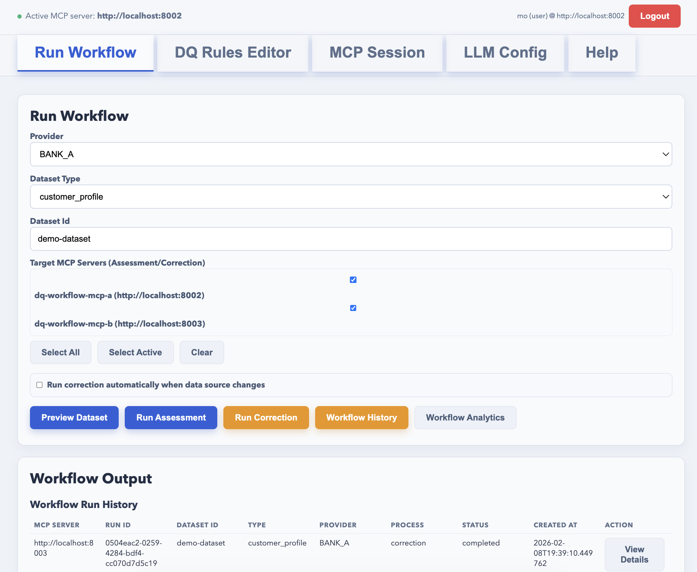
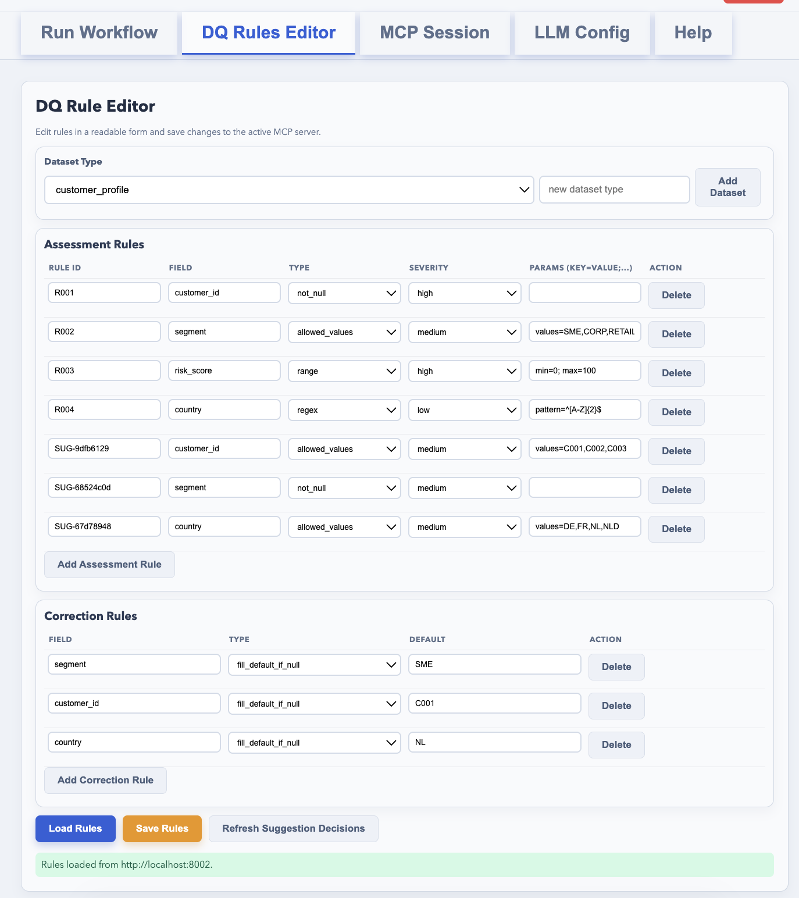
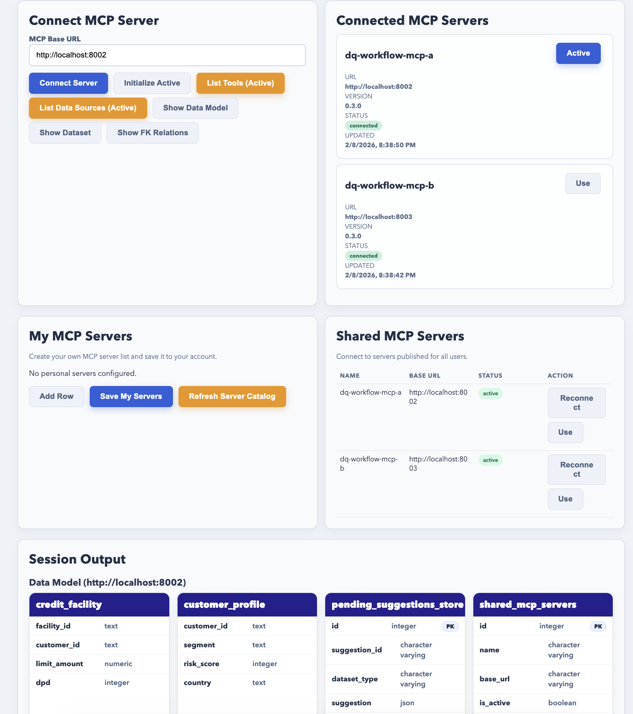
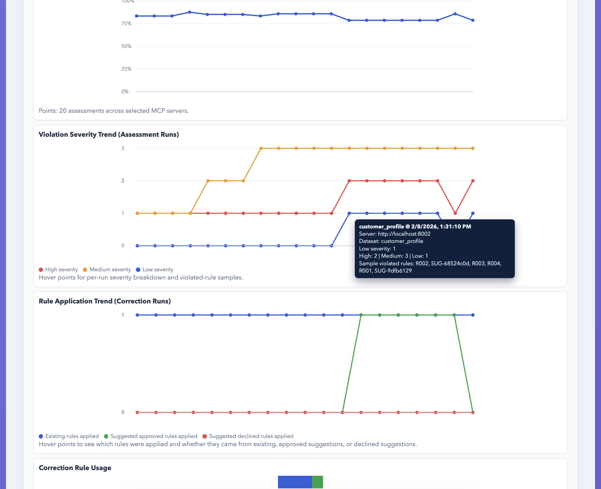

# Intelligent Data Quality Engine (IDQE)

This repo contains a demo and production-oriented baseline for the Data Quality Engine described in `Presentation Yoda Final v01.pptx`.

Detailed runbook: `/DQ/docs/run-demo.md`

Detailed documentation set:

- Demo installation: `/DQ/docs/install-demo-detailed.md`
- Production installation: `/DQ/docs/install-production-detailed.md`
- User manual: `/DQ/docs/user-manual.md`

## What is included

- `workflow-client`: web-based MCP client for workflow management
- `mcp-server`: MCP-style server with data source connectors and workflow orchestration
- `dq-engine`: assessment/correction engine with configurable LLM settings
- `postgres`: demo data source and workflow metadata storage
- `deploy/k8s`: enterprise deployment manifests
- `docker-compose.demo.yml`: local MacBook demo
- `docker-compose.prod.yml`: production container profile template

## New functionality highlights

- Multi-server workflow execution:
  - Run assessment/correction on one or many connected MCP servers in one action.
  - Per-server auth guard checks login on every selected target before execution.
- Connected MCP server management:
  - Delete (disconnect) any connected MCP server from `MCP Session`.
  - Automatically removes it from run targets, analytics targets, and clears its auth session.
- DQ Rule simulation mode:
  - `Simulate Rules` in `DQ Rules Editor` runs assessment using current in-editor rules without saving.
  - Returns readable simulation summary + violations table.
- Improved workflow history UX:
  - Each row in `Workflow Run History` is clickable to open run details.
- Workflow analytics enhancements:
  - Quality index trend line.
  - Rule application trend with distinction between:
    - existing rules
    - approved suggested rules
    - declined suggested rules
  - Hover tooltip on trend points with rule details.
  - SLA dashboard cards (quality score, correction coverage, suggestion review rate).
- MCP Session data-introspection tools:
  - `show_data_model` (ER-style model view)
  - `show_dataset`
  - `show_foreign_key_relations`
- Auth/admin hardening:
  - Login/register, per-user rule configuration, admin user management.
  - Write operations require authenticated user.
  - User-scoped workflow runs and suggestion decisions.
  - Login attempt throttling controls (`LOGIN_MAX_ATTEMPTS`, `LOGIN_WINDOW_SECONDS`, `LOGIN_LOCK_SECONDS`).
  - Last-active-admin protection: prevents deactivating/demoting the final active admin.
  - High severity suggested rules use two-person approval (owner + peer/admin).
  - Scheduler job claiming (`FOR UPDATE SKIP LOCKED`) prevents multi-replica duplicate job execution.

## Architecture

1. User works in browser on `workflow-client`.
2. Client calls `mcp-server` tools (`list_data_sources`, `preview_dataset`, `run_dq_assessment`, `run_correction`, `get_workflow_runs`).
3. `mcp-server` connects to source datasets in Postgres and calls `dq-engine`.
4. `dq-engine` evaluates rules and optional LLM-assisted behavior based on config file.
5. Workflow runs are stored for traceability and governance.

## UI Screenshots

Add screenshots under `docs/images/` with the filenames below:

- `run-workflow.png`
- `dq-rules-editor.png`
- `mcp-session.png`
- `analytics.png`

Then GitHub will render them directly in this README:






## Demo run (MacBook)

Prerequisites:

- Docker Desktop
- Docker Compose v2

Start:

```bash
cp .env.demo.example .env.demo
docker compose --env-file .env.demo -f docker-compose.demo.yml up --build
```

Open:

- Workflow MCP client: `http://localhost:8080`
- MCP server A API: `http://localhost:8002/docs`
- MCP server B API: `http://localhost:8003/docs`
- DQ engine API: `http://localhost:8001/docs`

Stop:

```bash
docker compose --env-file .env.demo -f docker-compose.demo.yml down
```

Reset database volume:

```bash
docker compose --env-file .env.demo -f docker-compose.demo.yml down -v
```

## LLM configuration

LLM is configured through YAML mounted into `dq-engine`.

Demo config: `/DQ/config/llm.demo.yaml`
Production config: `/DQ/config/llm.prod.yaml`

Schema:

```yaml
llm:
  provider: mock|openai|none
  model: gpt-4.1-mini
  endpoint: https://api.openai.com/v1
  api_key_env: OPENAI_API_KEY
  temperature: 0.0
```

## DQ rule configuration

DQ rules are configured in YAML and loaded by `mcp-server`:

- Demo: `/DQ/config/rules.demo.yaml`
- Production: `/DQ/config/rules.prod.yaml`

Main sections:

- `data_sources`
- `assessment_rules` (per dataset type)
- `correction_rules` (per dataset type)

Supported assessment rule `type` values in this demo:

- `not_null`
- `range` (with `params.min` / `params.max`)
- `allowed_values` (with `params.values`)
- `regex` (with `params.pattern`)

You can also edit rules in the web UI (`DQ Rule Editor`) at `http://localhost:8080`.

## Testing

Automated MCP/API smoke test:

```bash
cd /DQ
python3 scripts/test_mcp_flow.py
```

Manual UI test checklist:

- `/DQ/tests/manual-ui-tests.md`

## Auth Modes (Demo vs Production)

`mcp-server` supports two auth profiles:

- Demo profile:
  - `AUTH_MODE=demo`
  - `AUTH_REQUIRED=false` (default in demo compose)
  - Seeds demo admin (`DEMO_ADMIN_EMAIL`, `DEMO_ADMIN_PASSWORD`) if missing
- Production profile:
  - `AUTH_MODE=production`
  - `AUTH_REQUIRED=true` (default when `AUTH_MODE=production`)
  - Requires strong passwords on registration
  - Use a strong `AUTH_SECRET` and short token TTL
  - Set `CORS_ALLOW_ORIGINS` to your approved web client origin list
  - `UI_ALLOW_LLM_TAB=false` so LLM stays file-config-only in production UI

New auth/admin tools exposed by MCP server:

- `auth_register`
- `auth_login`
- `auth_me`
- `admin_list_users`
- `admin_update_user`
- `admin_list_shared_mcp_servers`
- `admin_save_shared_mcp_servers`
- `admin_access_review`
- `admin_rule_governance`
- `admin_compliance_report`

Additional workflow/data tools:

- `simulate_rules`
- `show_data_model`
- `show_dataset`
- `show_foreign_key_relations`

Phase-2 governance/automation tools:

- Rule lifecycle:
  - `list_rule_versions`
  - `get_rule_version`
  - `diff_rule_versions`
  - `rollback_rule_version`
- Drift and canary:
  - `refresh_drift_baseline`
  - `canary_assessment`
- Scheduling and SLA:
  - `create_workflow_job`
  - `list_workflow_jobs`
  - `toggle_workflow_job`
  - `run_due_workflow_jobs`
  - `list_alerts`
- Compliance and lineage:
  - `trace_lineage`
  - `export_audit_pack`
- Integrations and policy:
  - `create_ticket_from_run`
  - `admin_set_team_policy`
  - `admin_list_team_policies`

Environment flags for integrations:

- `EVENT_WEBHOOK_URL` for event callbacks (`quality_drop_detected`, `data_source_change_detected`, `sla_breach`)
- `TICKET_WEBHOOK_URL` for external ticket creation webhook
- `ALERT_QUALITY_THRESHOLD` to auto-create quality alerts

Web UI auth/admin:

- Login/Register page gates access to the application
- Users can connect to shared MCP servers published by admins (`Shared MCP Servers`)
- Users can connect to any MCP server by URL (`Connect MCP Server`)
- Connected servers can be deleted (disconnected) from the UI
- Admin-only controls:
  - Admin users see a single Admin-only page (no workflow/rules/session tabs)
  - user role/team/active management
  - shared MCP server catalog editor in `MCP Session`
  - admin audit log + access/governance/compliance reports
- Demo default admin credentials:
  - Email: `admin@idqe.local`
  - Password: `Admin123!`

Security/data isolation notes:

- Workflow runs and suggestion decisions are user-scoped by default.
- Pending LLM suggestions are persisted in DB (safe for multi-replica mcp-server).
- Browser auth session is stored in `sessionStorage` (not persistent local storage).

## Enterprise deployment baseline

Use `/DQ/deploy/k8s` as baseline:

- Namespace isolation
- Separate deployments for `workflow-client`, `mcp-server`, `dq-engine`
- Service-to-service connectivity
- ConfigMap for LLM config
- Secret-based database connection
- Ingress entrypoint for web client

Add in enterprise platform:

- managed PostgreSQL + read replicas
- API gateway + mTLS
- centralized IAM/RBAC
- observability stack (logs, traces, metrics)
- CI/CD with signed images

## Production compose with env file

1. Copy template:

```bash
cp /DQ/.env.prod.example /DQ/.env.prod
```

2. Edit `/DQ/.env.prod` with real values.

3. Deploy:

```bash
docker compose --env-file /DQ/.env.prod -f /DQ/docker-compose.prod.yml pull
docker compose --env-file /DQ/.env.prod -f /DQ/docker-compose.prod.yml up -d
```
